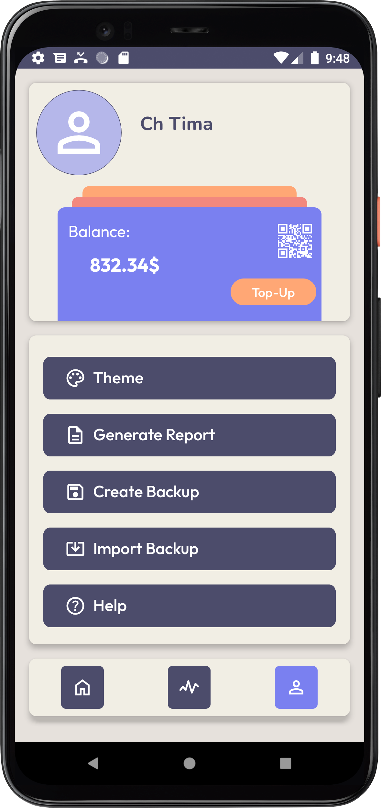

# WalletTracker

## Libraries
 - [Room v2.6.1](https://developer.android.com/jetpack/androidx/releases/room#2.6.1)
 - [Android RxJava3 v3.0.2](https://github.com/ReactiveX/RxJava)
 - [MPAndroidChart: v3.1.0](https://github.com/PhilJay/MPAndroidChart)

## Screenshot

### Design in [Figma](https://www.figma.com/design/ZpdvIpiz0IAwrlFpNMG8Sp/WT?node-id=0-1&t=MbGuKABSRCVSzXq9-0)

    
    
    

## Developer

- **Name**: Tymofii
- **GitHub**: [Ch-Tima](https://github.com/Ch-Tima/)
- **LinkedIn**: [Tymofii Chyzhevskyi](https://www.linkedin.com/in/tymofii-chyzhevskyi2004/)